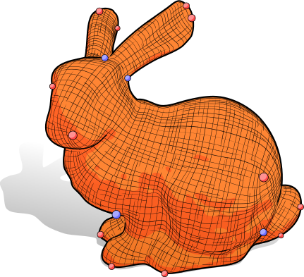
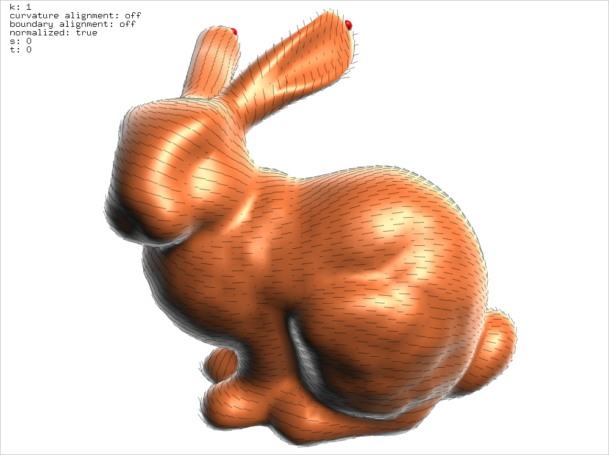

# fieldgen v0.02
--------------------------------------------
**authors:** Keenan Crane, Peter Schröder



## About

This code is a reference implementation of the paper

   >Felix Knöppel, Keenan Crane, Ulrich Pinkall, Peter Schröder  
   _"Globally Optimal Direction Fields"_  
   SIGGRAPH 2013

This version carefully implements the finite element connection Laplacian as
described in the paper, using Chebyshev expansions to ensure good numerics.  It
also supports some sophisticated features, such as holomorphic/anti-holomorphic
energy, alignment with principal curvature directions, and alignment with the
boundary.

The code itself is somewhat messy research code with a very basic user
interface.  Several other implementations are available, which use a less
sophisticated discretization of the connection Laplacian and do not support
some of the features mentioned above.  However, they may be useful for certain
tasks, or in different build settings.  In particular:

   - The `stripes` code provides a simple version of the algorithm,
     as well as editing of singularities and generation of a field-
     aligned parameterization:

       <http://www.cs.cmu.edu/~kmcrane/Projects/StripePatterns/code.zip>

   - There is an implementaiton in _Directional_, which is built on
     top of libigl and Eigen, and is hence header-only:

       <https://github.com/avaxman/Directional>

Note that `fieldgen` and stripes are both built on top of the CHOLMOD sparse
direct solver, whereas Directional is built on top of Eigen.  The latter can be
easier to install (since it is header only) but can be significantly slower,
since the Eigen Cholseky solver is much less mature than CHOLMOD.  See also
below for easy install instructions for CHOLMOD.

### Version History

* 0.01 (Sep 1, 2013) — Initial release
* 0.02 (Jun 4, 2019) — Added boundary alignment

## Installation

fieldgen depends on SuiteSparse, which you can obtain from

   <http://faculty.cse.tamu.edu/davis/suitesparse.html>

On most platforms, SuiteSparse can be installed via standard
package managers.  On Mac OS X / HomeBrew, it can be installed via

   ```brew install homebrew/science/suite-sparse```

To build, you will have to edit the Makefile and set the include/lib
paths accordingly.  Some examples are provided.  Once these paths
have been set, simply type

   ```make```

which (barring any compilation/linker errors) should build an executable
called `kvec`.


## Running

Once built, you should be able to run the executable by typing

```./kvec data/bunny.obj```

(or specifying a path to any mesh file in OBJ format).  You should
see a window showing the mesh and some information in the upper-left
corner.  Hitting `space` will generate the smoothest field on the surface:



Other commands can be accessed via the keyboard:

| key      | action
| -------- | -----------------------------------------------------------------------------
|  `space` | update field
|    `k/K` | increase/decrease the symmetry degree of the field
|    `s/S` | adjust the smoothness energy; -1=holomorphic, 0=Dirichlet, 1=antiholomorphic
|    `t/T` | adjust trade off between smoothness and curvature alignment (if enabled)
|      `c` | toggle curvature alignment
|      `b` | toggle boundary alignment
|      `m` | draw smooth shaded
|      `f` | draw faceted (with wireframe)
|  `` ` `` | take a screenshot
| `escape` | exit

**Note:** curvature alignment works only when the symmetry degree of the field is 2 or 4.

Currently there is no built-in functionality for writing direction fields to
disk, since there is no standard file format for fields and each user likely
has different needs.  The best place to look is at the code that draws the
field (in `Viewer.cpp`); one can also write the mesh itself using methods in
`MeshIO.cpp`.

## Source

Much of the source code in this archive is just there to support basic stuff
like loading a mesh, solving a linear system, etc.  The key routines are all in

* `Mesh.cpp`
* `KVecDir.cpp`
* `SectionIntegrals.cpp`

The main routines are


* `Mesh::InitKVecDirData()` — setup
* `Mesh::ComputeSmoothest()` — computes smoothest field
* `Mesh::ComputeSmoothestFixedBoundary()` — computes smoothest field aligned to the boundary
* `Mesh::SmoothestCurvatureAlignment()` — computes curvature-aligned field

An example of how these routines should be called is found in `Viewer::mSmoothField()`.


## License

This code is covered by a standard MIT license.

```
Copyright (c) 2013 Keenan Crane and Peter Schröder.

Permission is hereby granted, free of charge, to any person obtaining a copy
of this software and associated documentation files (the "Software"), to deal
in the Software without restriction, including without limitation the rights
to use, copy, modify, merge, publish, distribute, sublicense, and/or sell
copies of the Software, and to permit persons to whom the Software is
furnished to do so, subject to the following conditions:

The above copyright notice and this permission notice shall be included in all
copies or substantial portions of the Software.

THE SOFTWARE IS PROVIDED "AS IS", WITHOUT WARRANTY OF ANY KIND, EXPRESS OR
IMPLIED, INCLUDING BUT NOT LIMITED TO THE WARRANTIES OF MERCHANTABILITY,
FITNESS FOR A PARTICULAR PURPOSE AND NONINFRINGEMENT. IN NO EVENT SHALL THE
AUTHORS OR COPYRIGHT HOLDERS BE LIABLE FOR ANY CLAIM, DAMAGES OR OTHER
LIABILITY, WHETHER IN AN ACTION OF CONTRACT, TORT OR OTHERWISE, ARISING FROM,
OUT OF OR IN CONNECTION WITH THE SOFTWARE OR THE USE OR OTHER DEALINGS IN THE
SOFTWARE.
```

